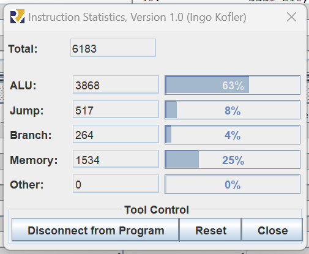
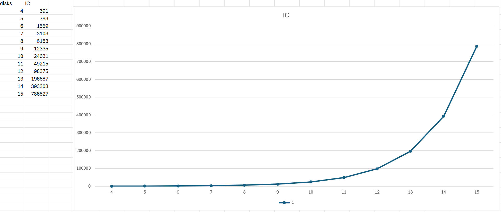

# Introduction
## Purpouse

# Hanoi Risc-V Development
## C code Hanoi Algorithm

```C
#include <stdio.h>
 
// C recursive function to solve tower of hanoi puzzle
void TowerOfHanoi(int n, char from_rod, char to_rod, char aux_rod) {
    if (n == 0) return;
    towerOfHanoi(n-1, from_rod, aux_rod, to_rod);
    printf("Move disk %d from rod %c to rod %c\n", n, from_rod, to_rod);
    TowerOfHanoi(n-1, aux_rod, to_rod, from_rod);
}

int main() {
    int N = 3; // Number of disks
    TowerOfHanoi(n, 'A', 'C', 'B');  // A, B and C are names of rods
    return 0;
}
```


## Explanation Risc-V code Hanoi Algorithm

# Tests
## 8 Disks Stadistics


## 4 <= N <= 15 Graphic 
