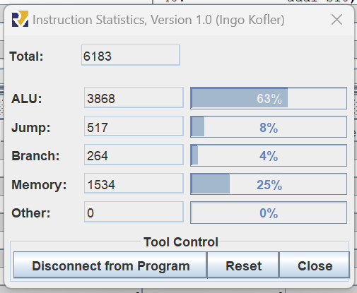
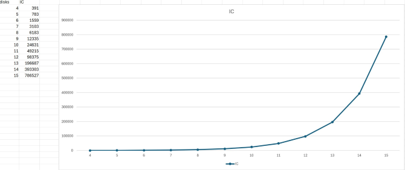

# Introduction
## History Context

The Hanoi Towers are a famous puzzle of mathematical origin, invented in 1883 by the French mathematician Edouard Lucas. This puzzle consists of a base with three rods or sticks called A, B and C, and a set of n disks of different sizes. Initially, the disks are stacked on rod A in decreasing order of size, with the largest disk at the bottom and the smallest at the top. The goal of the puzzle is to move all the disks from rod A to rod C, following two main rules: only one disk can be moved at a time, and at no time can a larger disk be placed on top of a smaller one.

## Practice

During practice, this assembly language puzzle was implemented using the RARS simulator, which supports the RISC-V architecture. This practice allows visualizing the moves necessary to solve the problem recursively, observing how the disks are progressively moved until the final configuration is reached on the C-rod. The process requires planning and understanding of the recursive structure of the solution, which is fundamental in low-level programming and computer architecture.

## Github repository

[https://github.com/Hoverpi/Hanoi_asm](https://github.com/Hoverpi/Hanoi_asm)

# Hanoi Risc-V Development
## C code Hanoi Algorithm

```C
#include <stdio.h>
 
// C recursive function to solve tower of hanoi puzzle
void TowerOfHanoi(int n, char from_rod, char to_rod, char aux_rod) {
    if (n == 0) return;
    TowerOfHanoi(n-1, from_rod, aux_rod, to_rod);
    printf("Move disk %d from rod %c to rod %c\n", n, from_rod, to_rod);
    TowerOfHanoi(n-1, aux_rod, to_rod, from_rod);
}

int main() {
    int N = 3; // Number of disks
    TowerOfHanoi(N, 'A', 'C', 'B');  // A, B and C are names of rods
    return 0;
}
```

## Risc-V Assembly Code

```python
.text
main:		
	    addi s0, zero, 3			# N = 3
	    
	    lui  s1, 0x10010
	    addi s1, s1, 0			# Torre A = 0x10010000
	    addi s2, s1, 4			# Torre B = 0x10010004
	    addi s3, s2, 4			# Torre C = 0x10010008
		
	    # Move B and C pointer to the start of stack
	    slli t0, s0, 5		        # start = N << 5
	    add  s2, s2, t0			# Direccion en memoria de B			
    	    add  s3, s3, t0			# Direccion en memoria de C

	    # Desplazamiento inicial en bytes
	    addi t2, zero, 0x00			# Desplazamiento inicial)
		
	    addi s10, zero, 0			# Counter
	    addi s11, zero, 0x20
		
        addi t1, s0, -1			# n = N - 1

	    addi t0, zero, 0			# i = 0
	    addi t5, zero, 0
		
for:	    beq  s0, t0, hanoi			# Si i == N, salir

            addi t1, t0, 1			# a = i + 1
	    # Calcular la dirección personalizada para almacenar el dato
	    add  t2, zero, s1			# t3 = dirección de almacenamiento
	    add  t4, t2, t5 
	    
            sw   t1, 0(t4)				# Guardar t1 en la dirección calculada
            
            addi t5, t5, 0x20			# count += 0x20
	    addi t0, t0, 1			# Incrementar i
    	    j    for				# Volver al inicio del bucle
		
end_for:    jal  ra, hanoi
	    j    exit
		
hanoi:	    addi t0, zero, 1
if:	    bne  s0, t0, else           		# Si s0 != 1, ir a else
	    sw   zero, 0x0(s1)             	# Borrar disco de SRC
	    add  s1, s1, s11          		# Mover SRC -> SRC + OFFSET
	    sub  s3, s3, s11         		# Mover DST -> DST - OFFSET
	    sw   s0, 0(s3)               		# Agregar disco a DST
	    addi s10, s10, 1			# counter = counter + 1
	    jalr ra                    		# Retornar de la recursión
	    
	    # Guardar ra y s0 en el stack antes de la primera llamada recursiva	
else:	    addi sp, sp, -4            		# Espacio en el stack
	    sw   ra, 0x0(sp)               		# Guardar ra
	    addi sp, sp, -4
	    sw   s0, 0x0(sp)               		# Guardar s0
	    addi s0, s0, -1            		# n = n - 1
	
	    # Intercambiar auxiliares para la llamada recursiva
	    add  t1, s2, zero           		# AUX -> TEMP
	    add  s2, s3, zero           		# AUX -> DST
	    add  s3, t1, zero           		# DST -> AUX/TEMP
	    
	    jal  ra, hanoi              		# hanoi(n-1, SRC, AUX, DST)
	
	    # Restaurar auxiliares para la siguiente llamada recursiva
	    add  t1, s2, zero           		# AUX -> TEMP
	    add  s2, s3, zero           		# AUX -> DST
	    add  s3, t1, zero           		# DST -> AUX/TEMP
	
	    # Restaurar s0 y ra después de la primera llamada recursiva
	    lw   s0, 0x0(sp)               		# Recuperar s0
	    addi sp, sp, 4
	    lw   ra, 0x0(sp)               		# Recuperar ra
	    addi sp, sp, 4
	
	    sw   zero, 0x0(s1)             	# Borrar disco de SRC
	    add  s1, s1, s11          		# Mover SRC -> SRC + OFFSET
	    sub  s3, s3, s11         		# Mover DST -> DST - OFFSET
	    sw   s0, 0x0(s3)               		# Agregar disco a DST
	    
	    addi s10, s10, 1 			# n = n + 1
	    
	    # Guardar ra y s0 en el stack antes de la segunda llamada recursiva
	    addi sp, sp, -4
	    sw   ra, 0x0(sp)               		# Guardar ra
	    addi sp, sp, -4
	    sw   s0, 0x0(sp)               		# Guardar s0
	    
	    addi s0, s0, -1            		# n = n - 1
	
	    # Intercambiar auxiliares para la segunda llamada recursiva
	    add  t1, s1, zero           		# TEMP -> AUX
	    add  s1, s2, zero           		# AUX -> DST
	    add  s2, t1, zero           		# DST -> TMP
	    jal  ra, hanoi              		# hanoi(n-1, AUX, DST, SRC)
	
	    # Restaurar auxiliares y limpiar el stack después de la segunda llamada
	    add  t1, s1, zero           		# TEMP -> SRC
	    add  s1, s2, zero           		# SRC -> AUX
	    add  s2, t1, zero           		# AUX -> TEMP
	    
	    lw   s0, 0x0(sp)               		# Recuperar s0
	    addi sp, sp, 4
	    lw   ra, 0x0(sp)               		# Recuperar ra
	    addi sp, sp, 4
	
	    jalr ra                    		# Retornar
	
exit:	    j    exit                     		# Fin del programa
```

## Registers Description

| Register | Description                                                                                                                                    |
|----------|------------------------------------------------------------------------------------------------------------------------------------------------|
| s0       | Contiene el número total de discos (N) utilizado para las operaciones en las Torres de Hanoi.                                                  |
| s1       | Dirección base para la Torre A en memoria.                                                                                                     |
| s2       | Dirección base para la Torre B en memoria.                                                                                                     |
| s3       | Dirección base para la Torre C en memoria.                                                                                                     |
| s10      | Contador de movimientos realizados durante la solución de las Torres de Hanoi.                                                                 |
| s11      | Offset constante (0x20) utilizado para calcular el desplazamiento en memoria entre posiciones de discos durante la manipulación de las torres. |
| sp       | Stack pointer, usado para manejar la pila durante las llamadas recursivas y almacenar temporalmente registros importantes como `ra` y `s0`.    |
| t0, t1   | Registros temporales utilizados para cálculos y comparación de valores en los bucles y condiciones del algoritmo.                              |
| t2, t4   | Utilizados para calcular y manejar las direcciones en memoria donde se almacenan los discos en las torres.                                     |
| t5       | Contador de desplazamiento en el bucle inicial, incrementado por 0x20 para organizar los discos.                                               |
| ra       | Registro de retorno, usado para almacenar la dirección de retorno en las llamadas recursivas.                                                  |


## Breakdown

```python
.text
main:		
	    addi s0, zero, 3			# N = 3
	    
	    lui  s1, 0x10010
	    addi s1, s1, 0			# Torre A = 0x10010000
	    addi s2, s1, 4			# Torre B = 0x10010004
	    addi s3, s2, 4			# Torre C = 0x10010008
		
	    # Move B and C pointer to the start of stack
	    slli t0, s0, 5		        # start = N << 5
	    add  s2, s2, t0			# Direccion en memoria de B			
    	    add  s3, s3, t0			# Direccion en memoria de C

	    # Desplazamiento inicial en bytes
	    addi t2, zero, 0x00			# Desplazamiento inicial)
		
	    addi s10, zero, 0			# Counter
	    addi s11, zero, 0x20
		
	    addi t1, s0, -1			# n = N - 1
```
First, the number of disks (N) is set to 3, storing this value in register s0. Then, a base memory address for Tower A (s1) is defined at 0x10010000, with addresses for Tower B (s2) and Tower C (s3) assigned at 0x10010004 and 0x10010008, respectively. Next, pointers for Towers B and C are adjusted in memory using the stack by calculating an offset (start) based on the number of disks N, which is left-shifted by 5 positions and stored in t0. This offset is then applied to the addresses of Towers B and C (s2 and s3), effectively adjusting their starting positions in memory.

Afterward, an initial offset and counters are initialized, with t2 set to 0 for the initial byte offset, a counter in s10 initialized to 0 for keeping track of movements, and s11 set to a constant value of 0x20, representing an offset for moving and manipulating the disk positions in memory. Finally, the value n is calculated as N - 1 and stored in t1 for future use in operations, particularly in the recursive logic of the algorithm.

```python
for:	    beq s0, t0, hanoi			# Si i == N, salir

            addi t1, t0, 1			# a = i + 1
	    # Calcular la dirección personalizada para almacenar el dato
	    add t2, zero, s1			# t3 = dirección de almacenamiento
	    add t4, t2, t5 
	    
            sw t1, 0(t4)				# Guardar t1 en la dirección calculada
            
            addi t5, t5, 0x20			# count += 0x20
	    addi t0, t0, 1			# Incrementar i
    	    j for				# Volver al inicio del bucle
		
end_for:    jal  ra, hanoi
	    j    exit
```


# Tests
## 8 Disks Stadistics


## 4 <= N <= 15 Graphic 


# Flowchart


# Conclusions

**Yael Salvador Morales Renteria:** By means of this practice we saw that to implement the towers of hanoi is something complicated in assembly language since in a language like C, pyhton, etc. it is easier since everything is integrated but in this language we saw that we use more than 100 lines of code to be able to make this exercise but thanks to this we can save memory inside the device that we are using and even in didactic terms as the machine solves this algorithm that we did.
