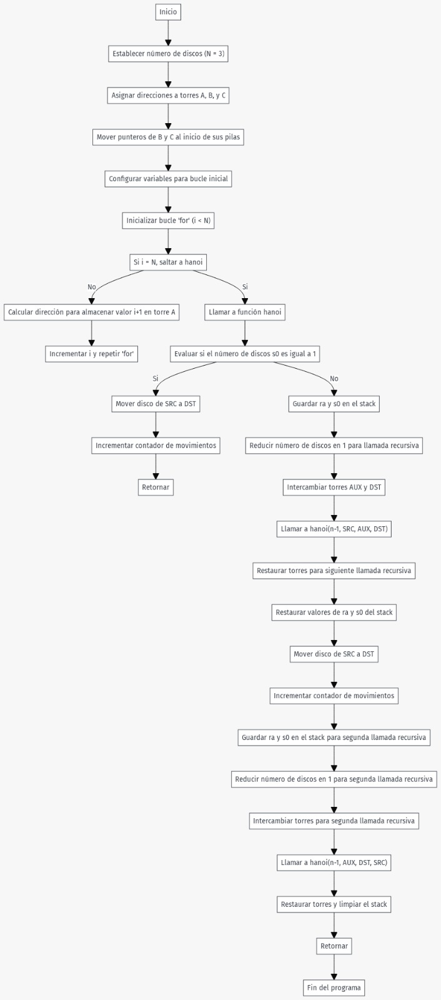

# Introduction
## History Context

The Hanoi Towers are a famous puzzle of mathematical origin, invented in 1883 by the French mathematician Edouard Lucas. This puzzle consists of a base with three rods or sticks called A, B and C, and a set of n disks of different sizes. Initially, the disks are stacked on rod A in decreasing order of size, with the largest disk at the bottom and the smallest at the top. The goal of the puzzle is to move all the disks from rod A to rod C, following two main rules: only one disk can be moved at a time, and at no time can a larger disk be placed on top of a smaller one.

## Practice

During practice, this assembly language puzzle was implemented using the RARS simulator, which supports the RISC-V architecture. This practice allows visualizing the moves necessary to solve the problem recursively, observing how the disks are progressively moved until the final configuration is reached on the C-rod. The process requires planning and understanding of the recursive structure of the solution, which is fundamental in low-level programming and computer architecture.

## Github repository

[https://github.com/Hoverpi/Hanoi_asm](https://github.com/Hoverpi/Hanoi_asm)

# Hanoi Risc-V Development
## C code Hanoi Algorithm

```C
#include <stdio.h>
 
// C recursive function to solve tower of hanoi puzzle
void TowerOfHanoi(int n, char from_rod, char to_rod, char aux_rod) {
    if (n == 0) return;
    TowerOfHanoi(n-1, from_rod, aux_rod, to_rod);
    printf("Move disk %d from rod %c to rod %c\n", n, from_rod, to_rod);
    TowerOfHanoi(n-1, aux_rod, to_rod, from_rod);
}

int main() {
    int N = 3; // Number of disks
    TowerOfHanoi(N, 'A', 'C', 'B');  // A, B and C are names of rods
    return 0;
}
```
[^1]


## Risc-V Assembly Code

```python
.text
main:		
	    addi s0, zero, 3			# N = 3 (number of disks)
	    
	    lui  s1, 0x10010			# Load upper immediate for the base address
	    addi s1, s1, 0			# Torre A = 0x10010000 (initialize base address for Tower A)
	    addi s2, s1, 4			# Torre B = 0x10010004 (initialize base address for Tower B)
	    addi s3, s2, 4			# Torre C = 0x10010008 (initialize base address for Tower C)
		
	    # Move B and C pointers to the start of stack
	    slli t0, s0, 5		        # start = N << 5 (shift left to calculate initial position)
	    add  s2, s2, t0			# Move Torre B pointer to calculated stack position
	    add  s3, s3, t0			# Move Torre C pointer to calculated stack position

	    # Initial offset in bytes
	    addi t2, zero, 0x00			# Initial offset set to 0
		
	    addi s10, zero, 0			# Counter initialized to 0
	    addi s11, zero, 0x20		# Offset value for moving between towers
		addi t1, s0, -1				# n = N - 1 (one less than the total disks)

	    addi t0, zero, 0			# i = 0 (initialize loop index)
	    addi t5, zero, 0			# Initialize count to 0
		
for:	    beq  s0, t0, hanoi			# If i == N, jump to hanoi (end loop)

            addi t1, t0, 1			# a = i + 1 (calculate the next disk number)
	    # Calculate the custom address for storing the disk number
	    add  t2, zero, s1			# Set t2 to the base address of the current tower
	    add  t4, t2, t5 			# Calculate the target address for storing the value
	    
            sw   t1, 0(t4)			# Store the disk number (t1) at the calculated address
	    
            addi t5, t5, 0x20			# Increment count by 0x20 (move to the next position)
	    addi t0, t0, 1			# Increment loop index i
    	    j    for				# Jump back to the start of the loop
		
end_for:    jal  ra, hanoi
	    j    exit
		
hanoi:	    addi t0, zero, 1
if:	    bne  s0, t0, else           	# If s0 != 1, jump to 'else'
	    sw   zero, 0x0(s1)             	# Remove disk from SRC
	    add  s1, s1, s11          		# Move SRC -> SRC + OFFSET
	    sub  s3, s3, s11         		# Move DST -> DST - OFFSET
	    sw   s0, 0(s3)               	# Place disk in DST
	    addi s10, s10, 1			# Increment counter
	    jalr ra                    		# Return from recursion
	    
	    # Save ra and s0 on the stack before the first recursive call	
else:	    addi sp, sp, -4            		# Reserve space in the stack
	    sw   ra, 0x0(sp)               	# Save ra
	    addi sp, sp, -4
	    sw   s0, 0x0(sp)               	# Save s0
	    addi s0, s0, -1            		# n = n - 1
	
	    # Swap auxiliary variables for the recursive call
	    add  t1, s2, zero           	# AUX -> TEMP
	    add  s2, s3, zero           	# AUX -> DST
	    add  s3, t1, zero           	# DST -> AUX/TEMP
	    
	    jal  ra, hanoi              	# hanoi(n-1, SRC, AUX, DST)
	
	    # Restore auxiliary variables for the next recursive call
	    add  t1, s2, zero           	# AUX -> TEMP
	    add  s2, s3, zero           	# AUX -> DST
	    add  s3, t1, zero           	# DST -> AUX/TEMP
	
	    # Restore s0 and ra after the first recursive call
	    lw   s0, 0x0(sp)               	# Recover s0
	    addi sp, sp, 4
	    lw   ra, 0x0(sp)               	# Recover ra
	    addi sp, sp, 4
	
	    sw   zero, 0x0(s1)             	# Remove disk from SRC
	    add  s1, s1, s11          		# Move SRC -> SRC + OFFSET
	    sub  s3, s3, s11         		# Move DST -> DST - OFFSET
	    sw   s0, 0x0(s3)               	# Place disk in DST
	    
	    addi s10, s10, 1 			# Increment counter
	    
	    # Save ra and s0 on the stack before the second recursive call
	    addi sp, sp, -4
	    sw   ra, 0x0(sp)               	# Save ra
	    addi sp, sp, -4
	    sw   s0, 0x0(sp)               	# Save s0
	    
	    addi s0, s0, -1            		# n = n - 1
	
	    # Swap auxiliary variables for the second recursive call
	    add  t1, s1, zero           	# TEMP -> AUX
	    add  s1, s2, zero           	# AUX -> DST
	    add  s2, t1, zero           	# DST -> TEMP
	    jal  ra, hanoi              	# hanoi(n-1, AUX, DST, SRC)
	
	    # Restore auxiliary variables and clear the stack after the second call
	    add  t1, s1, zero           	# TEMP -> SRC
	    add  s1, s2, zero           	# SRC -> AUX
	    add  s2, t1, zero           	# AUX -> TEMP
	    
	    lw   s0, 0x0(sp)               	# Recover s0
	    addi sp, sp, 4
	    lw   ra, 0x0(sp)               	# Recover ra
	    addi sp, sp, 4
	
	    jalr ra                    		# Return
	
exit:	    j    exit                   # End
```


## Registers Description

| Register | Description                                                                                                                                    |
|----------|------------------------------------------------------------------------------------------------------------------------------------------------|
| s0       | Contiene el número total de discos (N) utilizado para las operaciones en las Torres de Hanoi.                                                  |
| s1       | Dirección base para la Torre A en memoria.                                                                                                     |
| s2       | Dirección base para la Torre B en memoria.                                                                                                     |
| s3       | Dirección base para la Torre C en memoria.                                                                                                     |
| s10      | Contador de movimientos realizados durante la solución de las Torres de Hanoi.                                                                 |
| s11      | Offset constante (0x20) utilizado para calcular el desplazamiento en memoria entre posiciones de discos durante la manipulación de las torres. |
| sp       | Stack pointer, usado para manejar la pila durante las llamadas recursivas y almacenar temporalmente registros importantes como `ra` y `s0`.    |
| t0, t1   | Registros temporales utilizados para cálculos y comparación de valores en los bucles y condiciones del algoritmo.                              |
| t2, t4   | Utilizados para calcular y manejar las direcciones en memoria donde se almacenan los discos en las torres.                                     |
| t5       | Contador de desplazamiento en el bucle inicial, incrementado por 0x20 para organizar los discos.                                               |
| ra       | Registro de retorno, usado para almacenar la dirección de retorno en las llamadas recursivas.                                                  |


## Breakdown

```python
.text
main:		
	    addi s0, zero, 3			# N = 3
	    
	    lui  s1, 0x10010
	    addi s1, s1, 0			# Torre A = 0x10010000
	    addi s2, s1, 4			# Torre B = 0x10010004
	    addi s3, s2, 4			# Torre C = 0x10010008
		
	    # Move B and C pointer to the start of stack
	    slli t0, s0, 5		        # start = N << 5
	    add  s2, s2, t0			# Direccion en memoria de B			
    	    add  s3, s3, t0			# Direccion en memoria de C

	    # Desplazamiento inicial en bytes
	    addi t2, zero, 0x00			# Desplazamiento inicial)
		
	    addi s10, zero, 0			# Counter
	    addi s11, zero, 0x20
		
	    addi t1, s0, -1			# n = N - 1
```
First, the number of disks (N) is set to 3, storing this value in register s0. Then, a base memory address for Tower A (s1) is defined at 0x10010000, with addresses for Tower B (s2) and Tower C (s3) assigned at 0x10010004 and 0x10010008, respectively. Next, pointers for Towers B and C are adjusted in memory using the stack by calculating an offset (start) based on the number of disks N, which is left-shifted by 5 positions and stored in t0. This offset is then applied to the addresses of Towers B and C (s2 and s3), effectively adjusting their starting positions in memory.

Afterward, an initial offset and counters are initialized, with t2 set to 0 for the initial byte offset, a counter in s10 initialized to 0 for keeping track of movements, and s11 set to a constant value of 0x20, representing an offset for moving and manipulating the disk positions in memory. Finally, the value n is calculated as N - 1 and stored in t1 for future use in operations, particularly in the recursive logic of the algorithm.

```python
for:	    beq s0, t0, hanoi			# Si i == N, salir

            addi t1, t0, 1			# a = i + 1
	    # Calcular la dirección personalizada para almacenar el dato
	    add t2, zero, s1			# t3 = dirección de almacenamiento
	    add t4, t2, t5 
	    
            sw t1, 0(t4)				# Guardar t1 en la dirección calculada
            
            addi t5, t5, 0x20			# count += 0x20
	    addi t0, t0, 1			# Incrementar i
    	    j for				# Volver al inicio del bucle
		
end_for:    jal  ra, hanoi
	    j    exit
```

This section of the code iterates over the disks, storing each one in memory with a calculated address. The loop, starting at for, runs until i (t0) equals N (s0). In each iteration, it calculates the memory address using Tower A's base address (s1) plus an offset (t5). The disk number (t1 = i + 1) is then saved at this address.

The offset (t5) is updated by 0x20 for the next disk, and i is incremented. Once the loop finishes, the program jumps to the hanoi procedure for solving the Towers of Hanoi, and then moves to exit to end this segment.

```python
hanoi:	    addi t0, zero, 1
if:	    bne  s0, t0, else           		# If s0 != 1, jump to 'else'
	    sw   zero, 0x0(s1)             	# Remove disk from SRC
	    add  s1, s1, s11          		# Move SRC -> SRC + OFFSET
	    sub  s3, s3, s11         		# Move DST -> DST - OFFSET
	    sw   s0, 0(s3)               		# Place disk in DST
	    addi s10, s10, 1			# Increment counter
	    jalr ra                    		# Return from recursion
	    
	    # Save ra and s0 on the stack before the first recursive call	
else:	    addi sp, sp, -4            		# Reserve space in the stack
	    sw   ra, 0x0(sp)               	# Save ra
	    addi sp, sp, -4
	    sw   s0, 0x0(sp)               	# Save s0
	    addi s0, s0, -1            		# n = n - 1
	
	    # Swap auxiliary variables for the recursive call
	    add  t1, s2, zero           		# AUX -> TEMP
	    add  s2, s3, zero           		# AUX -> DST
	    add  s3, t1, zero           		# DST -> AUX/TEMP
	    
	    jal  ra, hanoi              		# hanoi(n-1, SRC, AUX, DST)
	
	    # Restore auxiliary variables for the next recursive call
	    add  t1, s2, zero           		# AUX -> TEMP
	    add  s2, s3, zero           		# AUX -> DST
	    add  s3, t1, zero           		# DST -> AUX/TEMP
	
	    # Restore s0 and ra after the first recursive call
	    lw   s0, 0x0(sp)               		# Recover s0
	    addi sp, sp, 4
	    lw   ra, 0x0(sp)               		# Recover ra
	    addi sp, sp, 4
	
	    sw   zero, 0x0(s1)             	# Remove disk from SRC
	    add  s1, s1, s11          		# Move SRC -> SRC + OFFSET
	    sub  s3, s3, s11         		# Move DST -> DST - OFFSET
	    sw   s0, 0x0(s3)               		# Place disk in DST
	    
	    addi s10, s10, 1 			# Increment counter
	    
	    # Save ra and s0 on the stack before the second recursive call
	    addi sp, sp, -4
	    sw   ra, 0x0(sp)               	# Save ra
	    addi sp, sp, -4
	    sw   s0, 0x0(sp)               	# Save s0
	    
	    addi s0, s0, -1            		# n = n - 1
	
	    # Swap auxiliary variables for the second recursive call
	    add  t1, s1, zero           		# TEMP -> AUX
	    add  s1, s2, zero           		# AUX -> DST
	    add  s2, t1, zero           		# DST -> TEMP
	    jal  ra, hanoi              		# hanoi(n-1, AUX, DST, SRC)
	
	    # Restore auxiliary variables and clear the stack after the second call
	    add  t1, s1, zero           		# TEMP -> SRC
	    add  s1, s2, zero           		# SRC -> AUX
	    add  s2, t1, zero           		# AUX -> TEMP
	    
	    lw   s0, 0x0(sp)               		# Recover s0
	    addi sp, sp, 4
	    lw   ra, 0x0(sp)               		# Recover ra
	    addi sp, sp, 4
	
	    jalr ra                    		# Return
```

This segment implements the recursive solution for the Towers of Hanoi. The base case (if) handles moving a single disk directly between source (SRC) and destination (DST). It removes the disk from SRC, adjusts the addresses using offsets, and places the disk in DST. If there are more than one disk (else), it recursively moves n-1 disks to an auxiliary tower (AUX), makes the move to the target tower, and then moves the n-1 disks from AUX to the destination.

During the recursion, registers ra (return address) and s0 (disk count) are saved on the stack. Offsets are adjusted to ensure that the disks are moved correctly, taking into account each recursive call's impact on the towers' state. The program finishes the recursion with a jalr instruction that returns to the previous recursive level or ends the function when all operations are complete.

# Tests
## 8 Disks Stadistics


<!---

-->
## 4 <= N <= 15 Graphic 
<!---

-->


# Flowchart
<!---

-->


# Conclusions

**Yael Salvador Morales Renteria:** By means of this practice we saw that to implement the towers of hanoi is something complicated in assembly language since in a language like C, pyhton, etc. it is easier since everything is integrated but in this language we saw that we use more than 100 lines of code to be able to make this exercise but thanks to this we can save memory inside the device that we are using and even in didactic terms as the machine solves this algorithm that we did.

**José Enrique Rios Gómez:** Implementing the Hanoi algorithm in assembly was an incredibly challenging experience, especially when recursion was introduced; it added an extra layer of complexity that made the task feel daunting. Despite the difficulties, I can't fault the language itself because assembly offers significant control over the operations being performed, which is undeniably valuable. However, for larger program development, I find it hard to envision myself using assembly. This is precisely why higher-level languages and their compilers exist. Nonetheless, from a learning standpoint, working with assembly proved to be an enriching experience, greatly enhancing my understanding of low-level operations and system mechanics.

# References
[^1]: [Hanoi Algorithm base code](https://www.geeksforgeeks.org/c-program-for-tower-of-hanoi/)